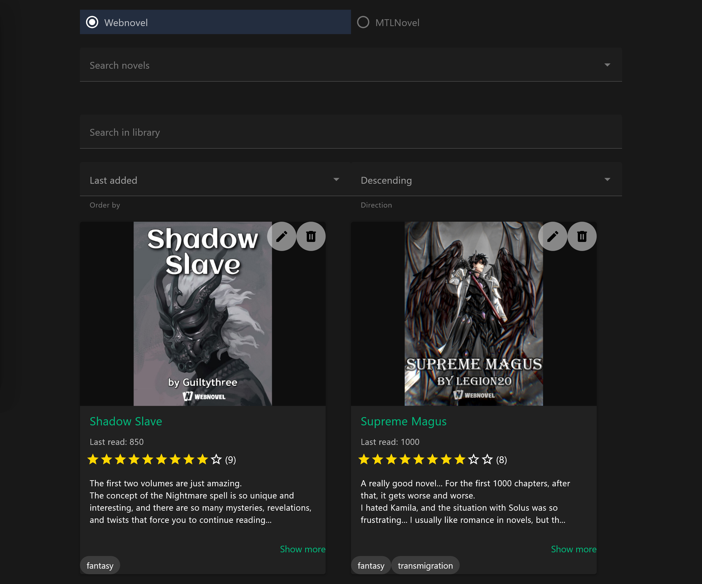
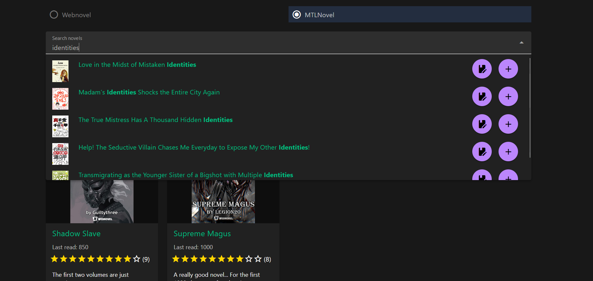

# NovelReview

NovelReview is a website where you can write reviews for novels available on WebNovel and MTLnovel.

## Overview

NovelReview offers several features:

- Search for novels on WebNovel.com and MTLNovel.com
- Add novels to your library
- Provide details like the last chapter read, tags, and your review
- Search and sort your library based on title, tags, and description

## Prerequisites

- NodeJS

## Instructions

To get started:

1. Clone the repository: `git clone https://github.com/DeeJack/NovelReview`
2. Run the server: `npm run server`
3. Run the frontend: `npm run dev`

Once done, access the frontend from `http://localhost:5173/` (by default).

## Technologies Used

- VueJS: Frontend development
- NodeJS + Express: Backend development
- SQLite: Local database storage

## Screenshots

## License

For licensing information, refer to [LICENSE](LICENSE) file.
