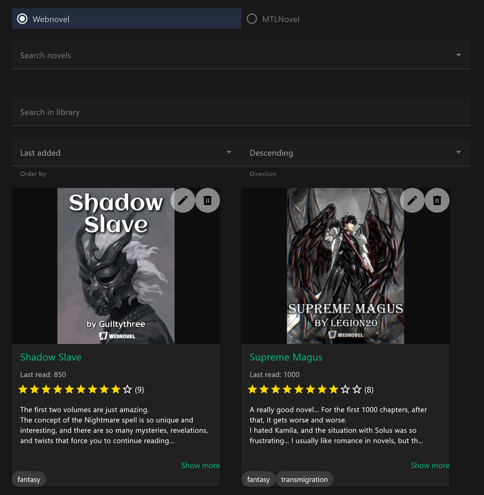
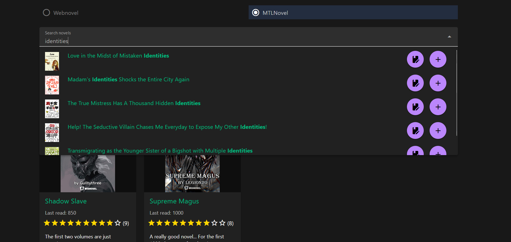
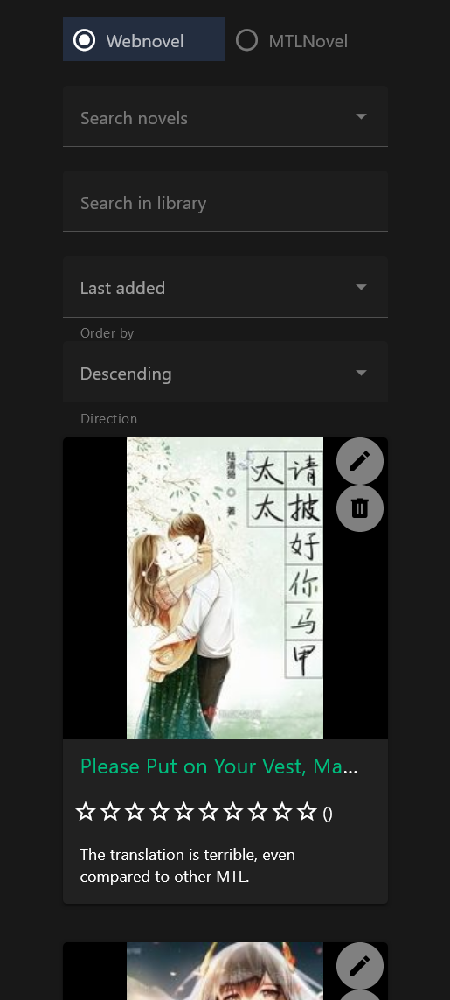
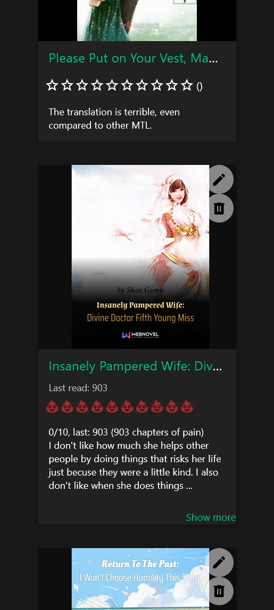

# NovelReview

NovelReview is a website where you can write reviews for novels available on WebNovel and MTLnovel.

## Overview

NovelReview offers several features:

- Search for novels on WebNovel.com and MTLNovel.com
- Add novels to your library
- Provide details like the last chapter read, tags, and your review
- Search and sort your library based on title, tags, and description

## Changes in version 0.1

- Separated the backend in different files for clarity
- Migrated to TypeScript the backend
- Fixed a few minor bugs (height of images in library, "show more" button)

## TO DO

- [ ] Add HTTPS
- [ ] Add an animation when loading edit page to prevent user from clicking other stuff.
- [ ] Add password request for modifications, to prevent unwanted requests.

## Prerequisites

- NodeJS

## Instructions

### Configuration

To get started:

1. Clone the repository: `git clone https://github.com/DeeJack/NovelReview`
2. [OPTIONAL] Set the server's IP address (if you want to use it from other devices):
   1. Create a `.env` file in the `frontend/` directory
   2. Set the `VITE_API_URL` to the IP address for the server. By default, the value will be set to `http://127.0.0.1:3000` (only local)
   3. Set `VITE_PORT` to change the frontend's port (default: 5000)
3. Run the server in the backend directory: `npm run dev`
4. Run the frontend in the frontend directory: `npm run dev`
5. [Optional]: use make to build and run them: `make build`, `make frontend`[/backend]

Once done, access the frontend from `http://localhost:5000/` (by default).

### Puppeteer on Linux

You need to install all the libraries listed on the file [install_linux.sh](install_linux.sh).

Then, if you are using a computer that doesn't have a display (probably a VPS), you need to use the commands:

1. `Xvfb&` (not sure if needed)
2. `npm run build`, `xvfb-run -a node dist/Server.js`, this will create a virtual display for the browser.

## Technologies Used

- VueJS: Frontend development
- NodeJS + Express: Backend development
- SQLite: Local database storage

## Screenshots

| Library pc                            | Search pc                            |
| ----------------------                | ----------------------               |
|  |  |

| Library phone                          | Search phone                        |
| ----------------------                 | ----------------------              |
|    |  |

## License

For licensing information, refer to [LICENSE](LICENSE) file.
